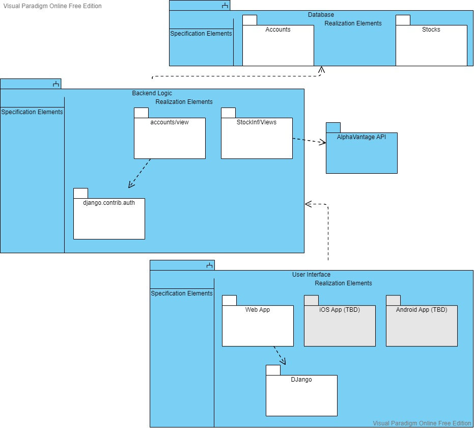
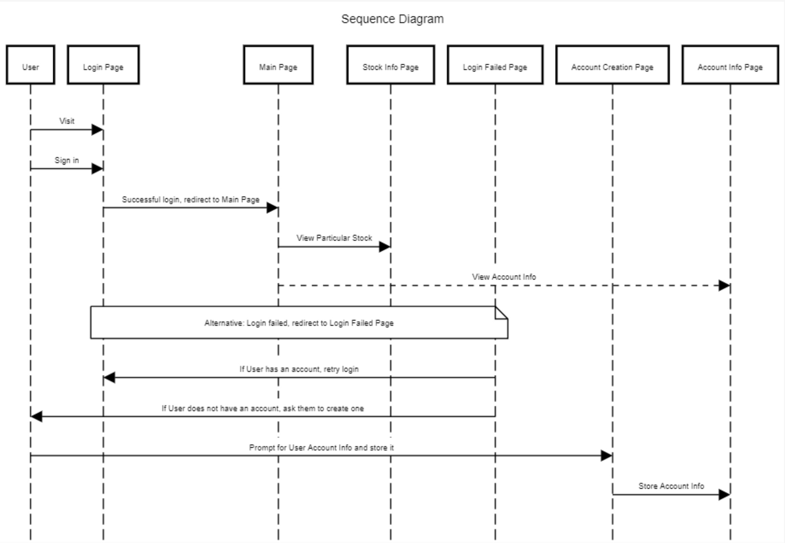

# Design

## 1. Description

StockInfinity aims to provide transparent stock information to users through multiple platforms to deliver a seamless experience and an exceptional level of accessibility. It is difficult to find a financial application that is not littered with unnecessary information. Many of the current stock application powerhouses have had incidents in which they were exposed for ingenuine practices which have large impacts on an investor’s financial well being. For those who need honest and uncluttered information about their favorite stocks, Stock Infinity can bridge the gap that larger firms and companies have been incapable of providing. Our product offers a friendly interface that allows you to see the information that you need without the extra fluff. You can be confident that our product will deliver the information you need for your financial future without fail. A simple, honest, and comprehensive application that allows both novice and expert investors to view information on their preferred stocks without having to sift through unnecessary information or worry about conflicting interests of shareholders affecting their access to information.

While StockInfinity is still in it's early development stages, our web application is available to select any and all users for local testing. This web app features a simple user interface with user experience as a main focal point, the ability to search for any publically traded stock within the U.S., and the ability to favorite stocks after creating an account. User profiles allow us to control notification timing, whether that be based on daily notifications or price updates on a selected interval. No longer do we need to rely on biased information! Now, everyone can find unbiased information on the stocks that they want to purchase.

Project repo: [Github link to StockInfinity](https://github.com/davidknight00/finance_app)

## 2. Architecture

Our architechture contains 3 main layers. The first layer is the User Interface which consists of 3 main targets: our web page, an iOS app, and an Android app. Currently, we only have a focus on our web app which requires DJango. The iOS app and Android app will require another engine to run, but can use the web app as the API for the interface. The second layer consists of our backend logic. The Accounts Views relies on the django authentication library to encrypt user passwords and protect their information from any malicious attacks. This determines which screen the user will see when creating an account, logging in or out, and resetting their password. The StockInf Views features the main content of searching for and viewing information on a publically traded U.S. stock. The final layer contains all of the stored data on user accounts and the stocks that they have favorited, as well as the information about the stocks that they have favorited.

****

## 3. Class Diagram

## 4. Sequence Diagram

This sequence diagram contains multiple use cases for our program. To go deeper into one of them, Viewing a Particular Stock has been shown in this diagram. Specifically it is shown what steps are taken to get to that use case. The diagram also notes that the User will access a stock's Information Page from the Main Page. When viewing a stock, the User will be able to see a compilation of information including the Stock's ticker, the Company Name, the Market Cap, the Yearly High/Low, as well as the Price/Earnings Ratio. 

****

## 5. Design Patterns

## 6. Design Principles
