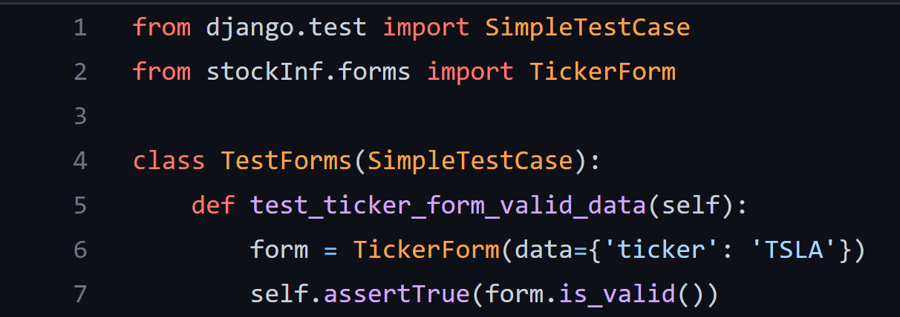

# Verification and Validation

## 1. Description

StockInfinity aims to provide transparent stock information to users through multiple platforms to deliver a seamless experience and an exceptional level of accessibility. It is difficult to find a financial application that is not littered with unnecessary information. Many of the current stock application powerhouses have had incidents in which they were exposed for ingenuine practices which have large impacts on an investor’s financial well being. For those who need honest and uncluttered information about their favorite stocks, Stock Infinity can bridge the gap that larger firms and companies have been incapable of providing. Our product offers a friendly interface that allows you to see the information that you need without the extra fluff. You can be confident that our product will deliver the information you need for your financial future without fail. A simple, honest, and comprehensive application that allows both novice and expert investors to view information on their preferred stocks without having to sift through unnecessary information or worry about conflicting interests of shareholders affecting their access to information.

While StockInfinity is still in its early development stages, our web application is available to select any and all users for local testing. This web app features a simple user interface with user experience as a main focal point, the ability to search for any publicly traded stock within the U.S., and the ability to favorite stocks after creating an account. User profiles allow us to control notification timing, whether that be based on daily notifications or price updates on a selected interval. No longer do we need to rely on biased information! Now, everyone can find unbiased information on the stocks that they want to purchase.

Project repo: [Github link to StockInfinity](https://github.com/davidknight00/finance_app)

## 2. Verification

### 2.1 Unit Test

#### 2.1.1
We used unittest, a built in library for Python to conduct our unit testing. 

#### 2.1.2
View our unit tests [here](https://github.com/davidknight00/finance_app/tree/master/stockInfinity/stockInf/tests)

#### 2.1.3
****
Here we are testing our form class to ensure that the form returns a valid input for a known U.S. publically traded stock's ticker. You can find the class [here](https://github.com/davidknight00/finance_app/blob/master/stockInfinity/stockInf/forms.py) and test file [here](https://github.com/davidknight00/finance_app/blob/master/stockInfinity/stockInf/tests/test_forms.py#L4-L7)

#### 2.1.4
The result of running the unit test can be seen in the image below
****

### 2.2 Acceptance Test

#### 2.2.1
We used the Selenium framework

#### 2.2.2

#### 2.2.3

#### 2.2.4

## 3. Validation/User Evaluation 
